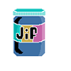
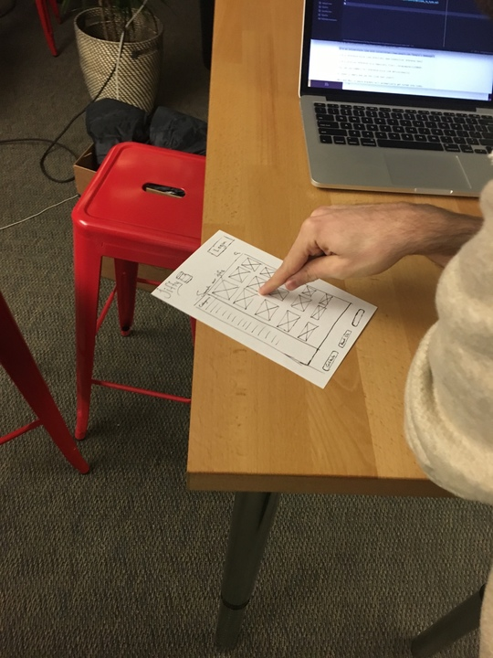
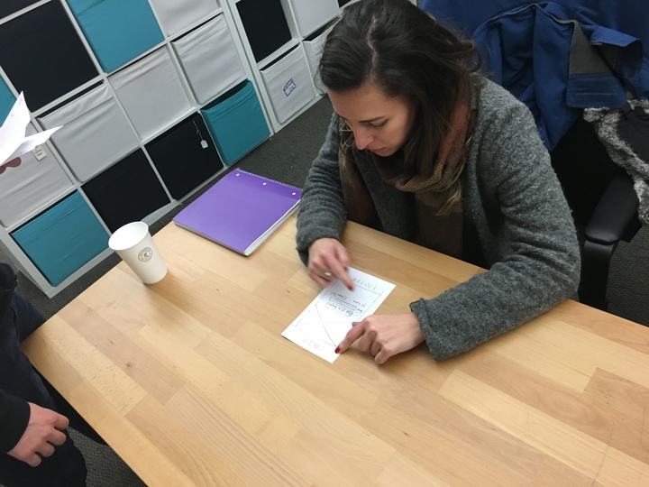
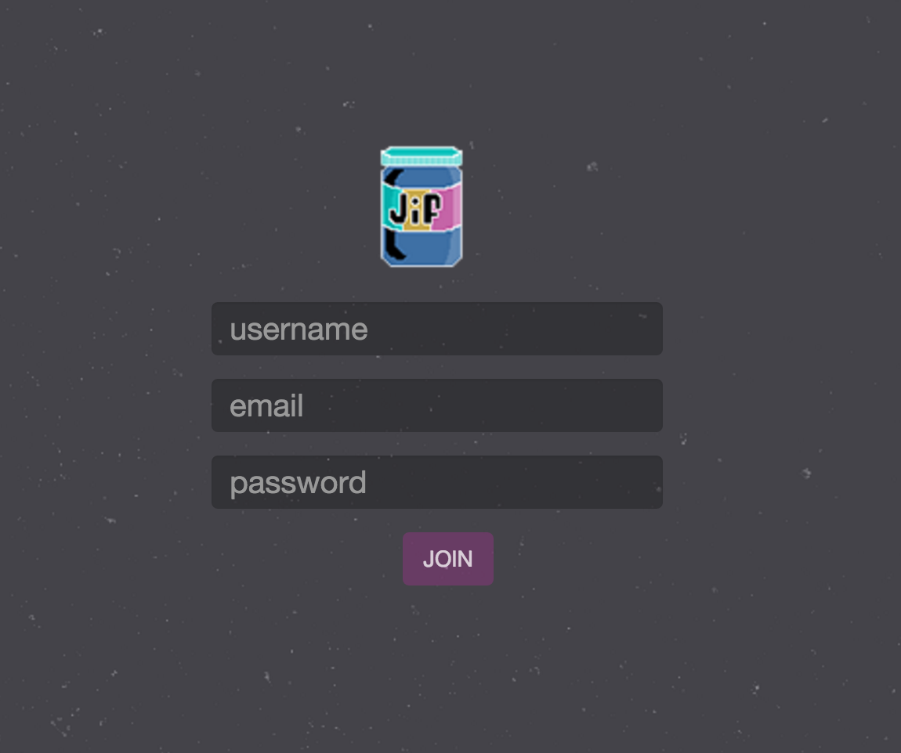
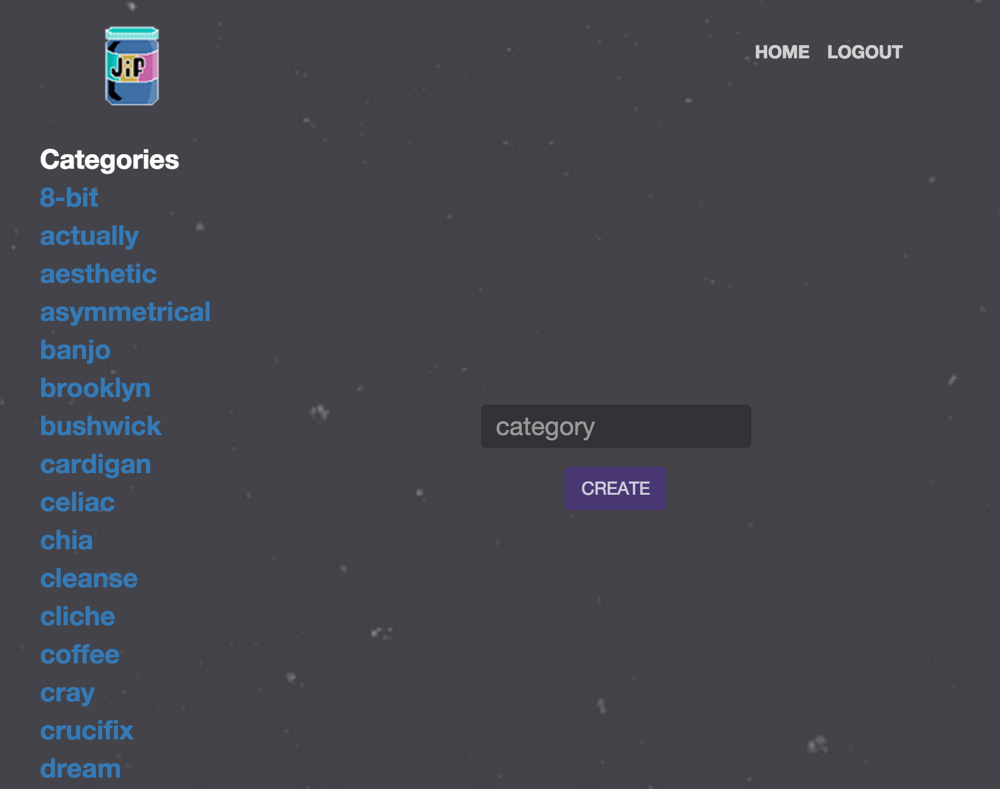

##Jiffy
Jiffy is an app that uses the Giphy API to generate GIFs, given a search term. Users with administrator status can create categories and corresponding GIFs. General users can browse categories and add GIFs to their Favorites, which will be stored on their profile pages.

The app is built with Ruby on Rails and styled with pure HTML/CSS. Testing uses RSpec and Capybara and the test suite can be run by running 'rake spec'.

The purpose of this project was to rapidly develop a functional Rails app that utilized an API (less than 10 hours) using a UX design process to guide our development decisions.

Login as an admin and create GIFs:
* username: admin
* password: admin

###Design Process
#####Prototype and Low Fidelity Testing
Before writing any code, we sketched out our vision for the database structure and user interface. Once we had an full user workflow designed with wireframes, we did our first round of usability testing by having users interact with our app via our wireframes. This led to both user interface and database structure insights that saved us time in development. Additionally, we used our own interaction with the wireframes to design comprehensive user stories, which guided our development as the narrative to our feature tests.

#####Production Slides

